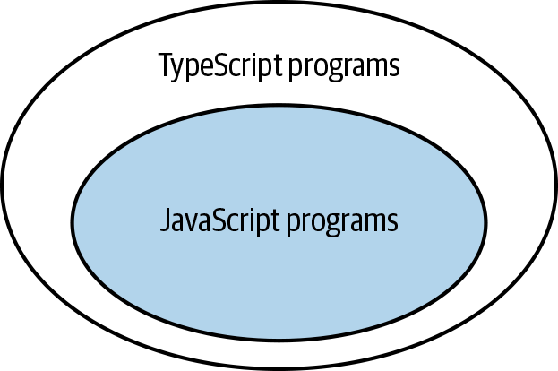

Typescript es un superset de javascript. Qué significa esto?
Todo código javascript es código typescript válido*1, pero no todo código typescript es código javascript válido.

*1: a excepciones de los programas javascript que no pasan el type check de typescript.



Uno de los principales objetivos de typescript es añadir tipado estático a javascript. Esto permite detectar errores en tiempo de compilación, en lugar de en tiempo de ejecución.

Veamos el siguiente ejemplo =>

```javascript
const states = [
  { name: "Alabama", capital: "Montgomery" },
  { name: "Alaska", capital: "Juneau" },
  { name: "Arizona", capital: "Phoenix" },
];

for (const state of states) {
  console.log(state.capitol);
}
```

El código anterior tiene un error de escritura en la propiedad `capitol` en lugar de `capital`. Este error no se detecta hasta que se ejecuta el código. Si usamos typescript, el error se detecta en tiempo de compilación.

```typescript
for (const state of states) {
  console.log(state.capitol);
  //                ~~~~~~~ Property 'capitol' does not exist on type
  //                        '{ name: string; capital: string; }'.
  //                        Did you mean 'capital'?
}
```

Con el solo hecho de añadir typescript a nuestro proyecto, sin siquiere agregar anoatción de tipos, ya estamos obteniendo un beneficio escribiendo código más seguro y confiable.

## Al agregar TS es importante entender la configuración utilizada

Para definir la configuración de typescript, se utiliza un archivo llamado `tsconfig.json`. Este archivo define las opciones de compilación de typescript.

```json
{
  "compilerOptions": {
    "target": "es5",
    "module": "commonjs",
    "strict": true,
    "noImplicitAny": true,
    "strictNullChecks": true,
  }
}
```

### NoImplicitAny

```typescript
function add(a, b) {
  //         ~    Parameter 'a' implicitly has an 'any' type
  //            ~ Parameter 'b' implicitly has an 'any' type
  return a + b;
}
```

### StrictNullChecks

```typescript
const x: number = null;
//    ~ Type 'null' is not assignable to type 'number'
```

Lo correcto sería definir `x` como `number | null`.

---

Para evitar tener que definir todas estas opciones, podemos utilizar `strict` que es un atajo para habilitar todas las opciones de tipo estricto.

```json
{
  "compilerOptions": {
    "target": "es5",
    "module": "commonjs",
    "strict": true,
  }
}
```

Algunas de las opciones que habilita `strict` son:
- useUnknownInCatchVariables
- strictPropertyInitialization

### tsc

El compilador de typescript se llama `tsc` y se encarga de:
- Convertir código typescript a javascript.
- Realizar el type check.

Todo código ts termina siendo código js, por lo que es importante entender que no puede resolver typescript.

- No puede realizar check de tipos en tiempo de ejecución.

```typescript
interface Square {
  width: number;
}
interface Rectangle extends Square {
  height: number;
}
type Shape = Square | Rectangle;

function calculateArea(shape: Shape) {
  if (shape instanceof Rectangle) {
    //                 ~~~~~~~~~ 'Rectangle' only refers to a type,
    //                           but is being used as a value here
    return shape.height * shape.width;
    //           ~~~~~~ Property 'height' does not exist on type 'Shape'
  } else {
    return shape.width * shape.width;
  }
}
```

Para resolver el error anterior, podemos utilizar un type guard, un tag dentro del objeto o transformar las interfaces en clases.

```typescript

interface Square {
  width: number;
}

interface Rectangle extends Square {
  height: number;
  tag: "rectangle";
}

type Shape = Square | Rectangle;

function calculateArea(shape: Shape) {
  if (shape.tag === "rectangle") {
    return shape.height * shape.width;
  } else {
    return shape.width * shape.width;
  }
}
```

- Modificacion de tipos no afecta los valores en tiempo de ejecución.

```typescript
function asNumber(val: number | string): number {
  return val as number;
}
```

Termina siendo lo mismo que:

```typescript
function asNumber(val) {
  return val;
}
```

Por lo que lo correcto sería:

```typescript
function asNumber(val: number | string): number {
  return Number(val);
}
```

- Los tipos declarados pueden ser diferentes a los valores asignados.

```typescript
function setLightSwitch(value: boolean) {
  switch (value) {
    case true:
      turnLightOn();
      break;
    case false:
      turnLightOff();
      break;
    default:
      console.log(`I'm afraid I can't do that.`);
  }
}
```

Alguno se le ocurre un caso donde esa función caiga en el default?

Por ejemplo, si se llama la función mediante la respuesta de una API, el valor puede ser diferente a `true` o `false`.

```typescript
interface LightApiResponse {
  lightSwitchValue: boolean;
}
async function setLight() {
  const response = await fetch('/light');
  const result: LightApiResponse = await response.json();
  setLightSwitch(result.lightSwitchValue);
}
```

- Agregar typescript afecta el performance de la aplicación? No, ya que typescript se compila a javascript. Puede afectar el tiempo de compilación.

### Typado abierto vs cerrado

Typescript, por defecto, es de tipado abierto. Esto significa que podemos añadir propiedades a un objeto que no estén definidas en la interfaz.

```typescript
interface Person {
  name: string;
}

const person: Person = {
  name: "John",
  age: 30,
};
```

Otro ejemplo,

```typescript

function calculateLengthL1(v: Vector3D) {
  let length = 0;
  for (const axis of Object.keys(v)) {
    const coord = v[axis];
    //            ~~~~~~~ Element implicitly has an 'any' type because ...
    //                    'string' can't be used to index type 'Vector3D'
    length += Math.abs(coord);
  }
  return length;
}
```

El error ocurre porque la logica asum que el typado es cerrado, pero no es así. la property `v` podría tener más propiedades que las definidas en la interfaz.

### any keyword

Al utilizar any, estamos diciendo a typescript que no realice el type check.

```typescript
let ageInYears: number;
ageInYears = '12';
// ~~~~~~~ Type '"12"' is not assignable to type 'number'
ageInYears = '12' as any;  // OK
```

Otro ejemplo

```typescript
function calculateAge(birthDate: Date): number {
  // ...
}

let birthDate: any = '1990-01-19';
calculateAge(birthDate);  // OK
```

Además, estamos perdiendo intellisense y autocompletado.